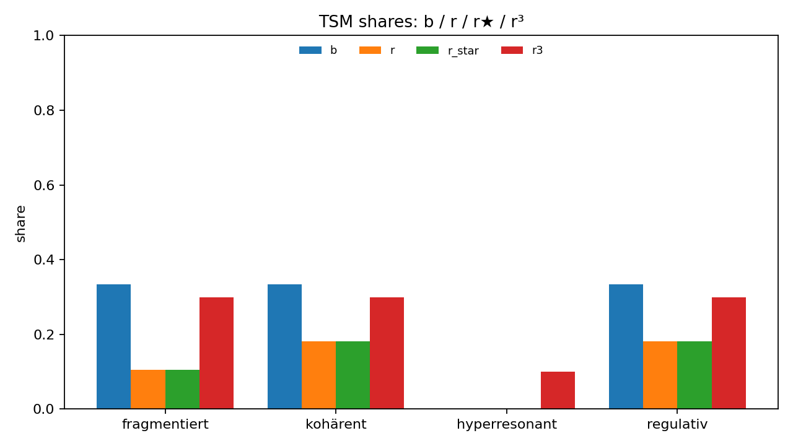
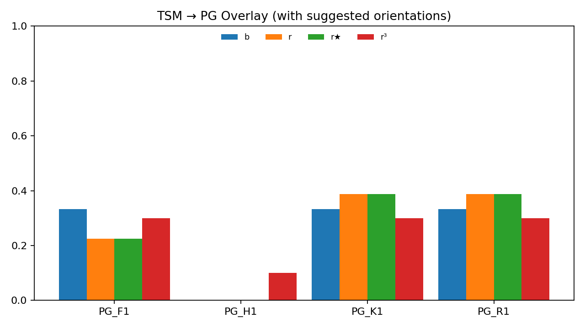

# TSM ↔ Positive Geometry — One-Pager

**Bundle:** `tsm-online-bundle_v1.25.json` (version **1.25**, 2025-09-17 17:14:45)
**Caps:** τ = **0.11**  ·  core_UB = **0.60**  ·  core = **kohärent, regulativ**

## Executive Summary (Auszug)
# Executive-Summary — Phase 3★ (b → r³)

## Facetten- & LIFT-Counts
- b@LB=0, r³@LB=0, b@UB=0, r³@UB=0
- LIFT(b)=2, LIFT(r³)=3

## r³ vs r★ — Top-Anhebungen
- fragmentiert: r★=0.105469 → r³=0.300000 | Δ=0.194531
- kohärent: r★=0.182065 → r³=0.300000 | Δ=0.117935
- regulativ: r★=0.182065 → r³=0.300000 | Δ=0.117935
- nan: r★=0.530400 → r³=nan | Δ=nan

## r³ vs r★ — Top-Absenkungen
- kohärent: r★=0.182065 → r³=0.300000 | Δ=0.117935
- regulativ: r★=0.182065 → r³=0.300000 | Δ=0.117935
- fragmentiert: r★=0.105469 → r³=0.300000 | Δ=0.194531
- nan: r★=0.530400 → r³=nan | Δ=nan

## r³ vs b — Top-Anhebungen
- fragmentiert: b=0.333333 → r³=0.300000 | Δ=-0.033333
- kohärent: b=0.333333 → r³=0.300000 | Δ=-0.033333
- regulativ: b=0.333333 → r³=0.300000 | Δ=-0.033333
- nan: b=0.000000 → r³=nan | Δ=nan

## r³ vs b — Top-Absenkungen
- fragmentiert: b=0.333333 → r³=0.300000 | Δ=-0.033333
- kohärent: b=0.333333 → r³=0.300000 | Δ=-0.033333
- regulativ: b=0.333333 → r³=0.300000 | Δ=-0.033333
- nan: b=0.000000 → r³=nan | Δ=nan

## Artefakte
- Bindings r³: `bridge/tsm_pg_bindings_phase3_star.csv`
- r³ vs r★: `bridge/phase3_r3_vs_rstar.csv`
- r³ vs b:  `bridge/phase3_r3_vs_b.csv`

## Hinweise (heuristisch)
- Große Abweichung r³ vs r★: Δ-Korridor (τ) zu streng/locker? CORE_UB anpassen.

## Keypoints (Auszug)
# Phase 3★ – 5 Kernpunkte

1) **Facetten- & LIFT-Counts**
   - b@LB=0, r³@LB=0, b@UB=0, r³@UB=0
   - LIFT(b)=2, LIFT(r³)=3

2) **r³ vs r★ — Top-Anhebungen**
- fragmentiert: r★=0.105469 → r³=0.300000 | Δ=+0.194531
- kohärent: r★=0.182065 → r³=0.300000 | Δ=+0.117935
- regulativ: r★=0.182065 → r³=0.300000 | Δ=+0.117935

3) **r³ vs r★ — Top-Absenkungen**
- kohärent: r★=0.182065 → r³=0.300000 | Δ=+0.117935
- regulativ: r★=0.182065 → r³=0.300000 | Δ=+0.117935
- fragmentiert: r★=0.105469 → r³=0.300000 | Δ=+0.194531

4) **r³ vs b — Top-Anhebungen**
- fragmentiert: b=0.333333 → r³=0.300000 | Δ=-0.033333
- kohärent: b=0.333333 → r³=0.300000 | Δ=-0.033333
- regulativ: b=0.333333 → r³=0.300000 | Δ=-0.033333

5) **r³ vs b — Top-Absenkungen**
- fragmentiert: b=0.333333 → r³=0.300000 | Δ=-0.033333
- kohärent: b=0.333333 → r³=0.300000 | Δ=-0.033333
- regulativ: b=0.333333 → r³=0.300000 | Δ=-0.033333

## PG-Overlay — Metriken
- r³ vs r★:   L1 = **0.350813**,  Kosinus = **0.956854**
- r³ vs b:    L1 = **0.200000**,  Kosinus = **0.981981**

## PG-Crosswalk (TSM → PG)
| Zone | PG-Facet | Orientation |
|---|---|---|
| fragmentiert | PG_F1 | +1 |
| kohärent | PG_K1 | +1 |
| hyperresonant | PG_H1 | +1 |
| regulativ | PG_R1 | -1 |

## Abbildungen

## Artefakte (Repo-Pfade)
- `bridge/tsm-online-bundle_v1.25.json` (inkl. Brücke)
- `bridge/tsm_symbolic_bridge_v0.1.json`, `bridge/pg_crosswalk.csv`
- `bridge/pg_overlay*.{csv,md,png}`
- `bridge/README_exec_summary_phase3_star.md`, `bridge/KEYPOINTS_phase3.md`
